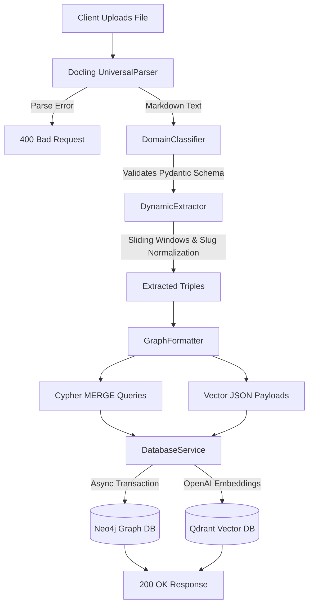
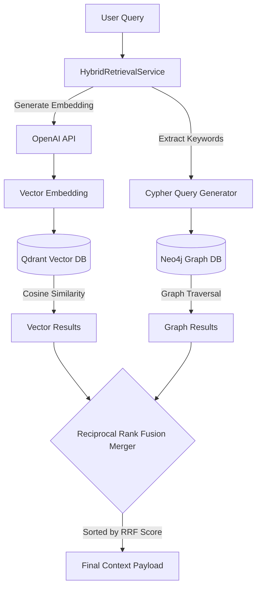

# SecureVault Architecture

SecureVault is a high-performance **Zero-Shot Extraction and Hybrid Retrieval Pipeline**. It is designed to strictly parse raw documents, dynamically extract structured knowledge graphs and semantic vectors using LLMs, and retrieve information by fusing graph traversal with vector similarity.

---

## 🚀 Core Features

1. **Strict Fail-Fast Parsing:** No "fuzzy fallbacks." Unrecognized or overly complex documents are instantly rejected to prevent garbage data from entering the pipeline.
2. **Zero-Shot Domain Classification:** Dynamically analyzes document snippets to deduce the domain, document type, and a tailored knowledge schema on the fly.
3. **Sliding-Window Extraction:** Processes massive documents via asynchronous sliding windows, generating "Knowledge Triples" (Subject -> Predicate -> Object).
4. **Entity Resolution (Slug Strategy):** Enforces a strict LLM prompting strategy to normalize entities into unique slugs (e.g., `PRIMARY_COOLANT_SYSTEM`). This allows the Graph database to effortlessly deduplicate and connect entities across overlapping text windows.
5. **Hybrid Retrieval Engine (RRF):** Unifies search results by running concurrent vector and graph searches, combining the results using the mathematical Reciprocal Rank Fusion (RRF) algorithm.

---

## 🛠️ Technology Stack & Tools

* **Backend Framework:** `FastAPI` (with `uvicorn`) for an asynchronous, high-concurrency API server.
* **Document Parsing:** `Docling` to robustly convert PDFs and raw text into clean, structured Markdown.
* **LLM Inference:** `Fireworks.ai` (Serverless API) driving the cognitive engine. 
  * Classification: `qwen3-8b`
  * Complex Extraction: `llama-v3p3-70b-instruct`
* **Embeddings:** `OpenAI` (`text-embedding-3-small`) to generate 1536-dimensional dense vectors.
* **Graph Database:** `Neo4j` (running locally via Docker) to store entities and their contextual relationships.
* **Vector Database:** `Qdrant` (running locally via Docker) to store and query dense semantic vectors.
* **Data Validation:** `Pydantic` guarantees that outputs from LLMs exactly match required Python schemas before proceeding.

---

## 📐 Architecture Data Flows

### 1. The Ingestion Pathway (`/ingest`)

When a document is uploaded, it passes through a rigorous sequence of transformations before landing in the databases.

### 2. The Hybrid Retrieval Pathway (`/query`)

When a user asks a question, SecureVault fetches data from both databases concurrently and mathematically fuses the results.

---

## 📂 System Component Breakdown

| File | Purpose |
| :--- | :--- |
| `api.py` | The FastAPI entry point. Defines endpoints and global exception handlers to enforce fail-fast behavior. |
| `document_parser.py` | Wraps `Docling` to convert binary files into Markdown. |
| `domain_classifier.py` | Uses `qwen3-8b` to read a document snippet and output a Pydantic-validated JSON schema identifying the domain. |
| `dynamic_extractor.py` | The heavy lifter. Chunks text into overlapping windows and uses `llama-v3p3-70b-instruct` to extract knowledge triples while stripping `<think>` blocks and un-nesting LLM hallucinations. |
| `graph_formatter.py` | Translates raw Python dictionary triples into Neo4j Cypher `MERGE` statements and Qdrant JSON payloads. |
| `database_service.py` | Manages persistent async connections to Dockerized Neo4j and Qdrant. Handles transaction batching and OpenAI embedding generation. |
| `retrieval_service.py` | Executes the Hybrid Retrieval. Queries both databases concurrently and unifies the distinct node structures into a single ranked list via the RRF formula: $S(d) = \sum \frac{1}{k + r(d)}$. |
| `test_architecture.py` | A rigorous HTTP testing suite simulating complete end-to-end user flows. |
