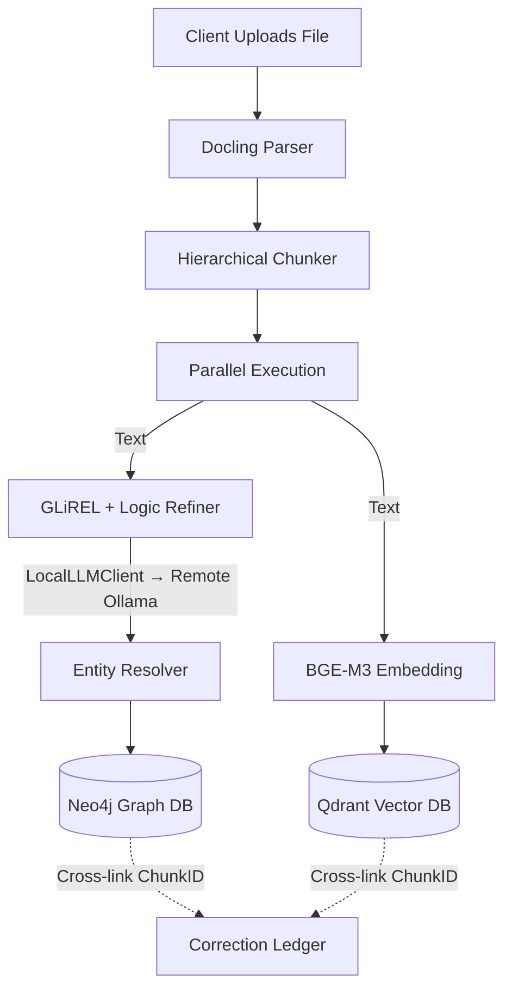
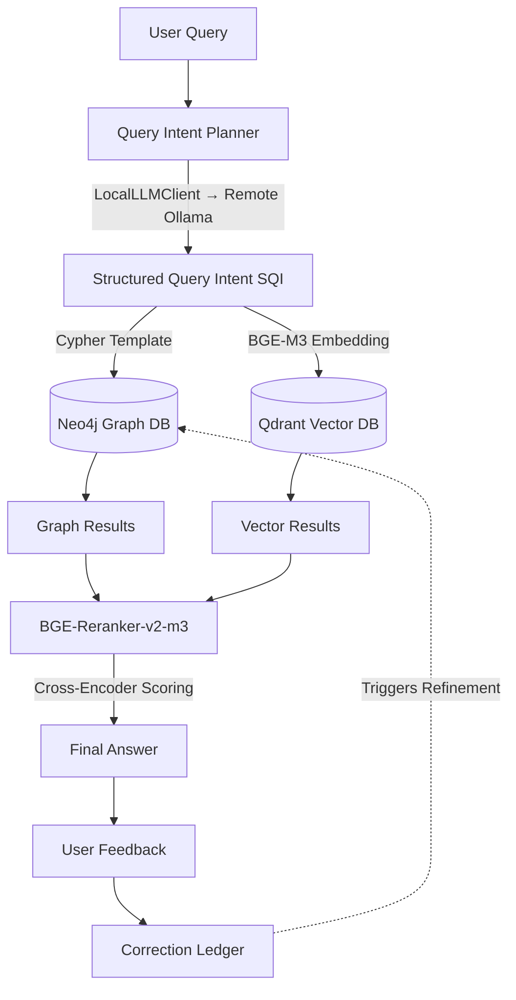

# SentinelVault Architecture

SentinelVault is a **High-Integrity Knowledge Orchestration Pipeline** backed by a self-hosted remote LLM. It transforms unstructured documents into a Property Knowledge Graph and Multi-Vector Space, leveraging multi-stage entity resolution, logic-refined extraction, and intent-based query planning. LLM inference is fully externalised to a remote Ollama server — no model weights are loaded in-process.

---

## 🚀 Core Features

1. **Remote LLM Inference:** All generative reasoning is delegated to a self-hosted Ollama server (`qwen2.5:3b-instruct-q4_K_M`) via its OpenAI-compatible `/v1/chat/completions` API. No model weights are loaded inside the FastAPI process.
2. **Dual-Layer Extraction Pipeline:** Combines blazing-fast zero-shot relation tagging (GLiREL) with remote LLM logical reasoning to resolve implicit relationships and long-range dependencies.
3. **Multi-Stage Entity Resolution:** A strict four-stage deduplication pipeline (Normalization → Blocking → Semantic Similarity → Graph Context) prevents node duplication while preserving intentional disambiguation.
4. **Intent-Based Query Planning:** Translates natural language into a Structured Query Intent (SQI) JSON object rather than generating raw Cypher, preventing hallucinations and ensuring safe graph traversals. Shares the central `LocalLLMClient` to avoid duplicate connections.
5. **Cross-Encoder Reranking:** Merges results from sparse graph context and dense vector search, scoring the combined set using a cross-encoder (`BGE-Reranker-v2-m3`) to prevent RRF bias.
6. **Correction Ledger:** Maintains a full audit trail for confidence metadata, user feedback, and correction signals to drive continuous refinement.
7. **Strict Execution & Hardware Validation:** Enforces a configurable minimum VRAM threshold for local embedding models (`BGE-M3`, `BGE-Reranker-v2-m3`). Can be bypassed via `REQUIRE_GPU=false` for CPU-only operation. All ML inference and JSON parsing uses strict error handling with no silent fallbacks.

---

## 🛠️ Technology Stack & Tools

| Layer | Technology |
| :--- | :--- |
| **Core Orchestration** | `.NET 10` service communicating with the RAG layer over HTTP |
| **API Layer** | `FastAPI` (Python) — manages endpoints, middleware, and orchestrates data flows |
| **LLM Backend** | Remote self-hosted **Ollama** server · model: `qwen2.5:3b-instruct-q4_K_M` · endpoint: `http://134.199.148.99:11434/v1` |
| **LLM Client** | `openai` Python SDK (`AsyncOpenAI`) targeting the Ollama `/v1` OpenAI-compatible endpoint |
| **Document Parsing** | `Docling` — extracts layout-aware Markdown, preserves structural hierarchy |
| **Logic Extraction** | `GLiREL` (zero-shot) + remote LLM (implicit reasoning via `LocalLLMClient`) |
| **Query Planner** | Remote LLM via shared `LocalLLMClient` — parses intent into SQI JSON |
| **Embeddings** | `BGE-M3` (1024-dimensional dense vectors) — runs locally |
| **Reranker** | `BGE-Reranker-v2-m3` (cross-encoder) — runs locally |
| **Graph Database** | `Neo4j` (Docker) — stores the Property Knowledge Graph |
| **Vector Database** | `Qdrant` (Docker) — stores and queries dense semantic vectors |
| **Structured Logging** | `loguru` with per-request correlation ID injection via middleware |
| **Data Validation** | `Pydantic v2` enforcing cybersecurity and B2B domain ontologies |

---

## ⚙️ LLM Configuration

LLM connection parameters are **100% environment-driven**. There are no hardcoded fallback values — if any variable is missing, `AsyncOpenAI` will raise a clear error at startup.

| Environment Variable | Purpose | Example Value |
| :--- | :--- | :--- |
| `LLM_BASE_URL` | Base URL for the Ollama OpenAI-compatible endpoint | `http://134.199.148.99:11434/v1` |
| `LLM_MODEL_ID` | Model name as registered in Ollama | `qwen2.5:3b-instruct-q4_K_M` |
| `LLM_API_KEY` | API key sent in the `Authorization` header (Ollama convention) | `ollama` |
| `LLM_JSON_RETRIES` | Max retry attempts for `complete_json()` on malformed output | `3` (default) |

All LLM calls are routed exclusively through `llm_client.py` (`LocalLLMClient`). No other module initiates model inference.

---

## 📐 Architecture Data Flows

### 1. The Ingestion Pathway (`/v1/ingest`)

When a document is uploaded, it passes through a rigorous sequence of local models before landing in the databases.

```mermaid
graph TD
    A[Client Uploads File] --> B[Docling Parser]
    B --> C[Hierarchical Chunker]

    C --> D[Parallel Execution]

    D -->|Text| E[GLiREL + Logic Refiner]
    E -->|LocalLLMClient → Remote Ollama| F[Entity Resolver]
    F --> G[(Neo4j Graph DB)]

    D -->|Text| H[BGE-M3 Embedding]
    H --> I[(Qdrant Vector DB)]

    G -.->|Cross-link ChunkID| J[Correction Ledger]
    I -.->|Cross-link ChunkID| J
```

### 2. The Hybrid Retrieval Pathway (`/v1/query`)

When a user asks a question, the Query Planner constructs an execution intent via the remote LLM.

```mermaid
graph TD
    A[User Query] --> B[Query Intent Planner]
    B -->|LocalLLMClient → Remote Ollama| C[Structured Query Intent SQI]

    C -->|Cypher Template| D[(Neo4j Graph DB)]
    C -->|BGE-M3 Embedding| E[(Qdrant Vector DB)]

    D --> F[Graph Results]
    E --> G[Vector Results]

    F --> H[BGE-Reranker-v2-m3]
    G --> H

    H -->|Cross-Encoder Scoring| I[Final Answer]
    I --> J[User Feedback]
    J --> K[Correction Ledger]
    K -.->|Triggers Refinement| D
```

---

## 📂 System Component Breakdown

| File | Purpose |
| :--- | :--- |
| `api.py` | FastAPI entry point. Handles HTTP endpoints, loguru middleware (correlation IDs), API key auth on `/v1/*` routes, global exception handler, and Docker health check endpoint. |
| `llm_client.py` | Central async LLM client. Wraps `AsyncOpenAI` targeting the remote Ollama `/v1` endpoint. Exposes `complete()` and `complete_json()` (with exponential-backoff retries). All config is env-driven. |
| `document_parser.py` | Wraps `Docling` to extract layout-aware Markdown. Outputs structured chunks anchored to their context (section path, page, heading depth). |
| `logic_extractor.py` | Dual-layer extraction pipeline. Runs `GLiREL` for zero-shot relation tagging, then calls `LocalLLMClient` for implicit relationship reasoning. Validates triples strictly. |
| `entity_resolver.py` | Four-stage deduplication pipeline (Normalization, Blocking, Semantic Similarity via BGE-M3, Graph Context via Neo4j). |
| `query_planner.py` | Converts natural language queries into a Structured Query Intent (SQI) using the shared `LocalLLMClient`. Maps to pre-validated safe Cypher templates. |
| `database_service.py` | Async transaction manager for Neo4j and Qdrant. Handles BGE-M3 embedding batches and maintains cross-links between the two stores. |
| `reranker_service.py` | Uses `BGE-Reranker-v2-m3` to merge and score candidate result sets from Neo4j and Qdrant. |
| `audit_logger.py` | Manages the Correction Ledger. Persists extraction confidence metadata, user correction signals, and maintains an audit trail. |
